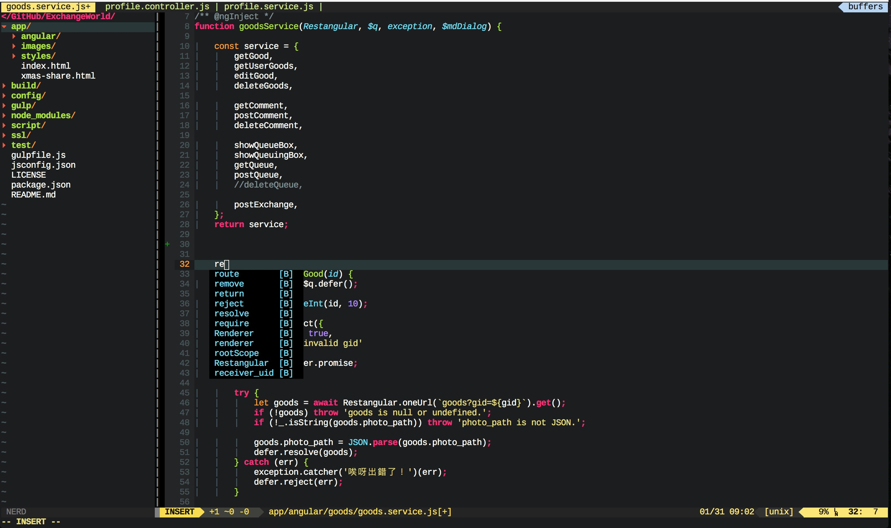

# ssarcandy-vim

My vim settings and plugins, compatible with [MacVim](http://macvim-dev.github.io/macvim/) in OSX

## Install
I use [Pathogen](https://github.com/tpope/vim-pathogen) for auto-load all plugins.  
Installation is simple, just do following command in terminal:

```bash
# clone into your home dir/
~$ git clone https://github.com/SSARCandy/ssarcandy-vim.git

# rename as .vim/ and copy .vimrc to home dir/
~$ mv ssarcandy-vim .vim && cp .vim/.vimrc ~

# install plugins
~$ cd .vim/
~$ git submodule foreach --recursive git pull origin master   

# or you can use the installation script
~$ ./install.sh
```

## Update plugins

```bash
~$ git submodule update --recursive

# or you can use the updating script
~$ ./update.sh
```

## Screenshots



## Common problems

 - Q: airline glyphs cannot show normally.
 - A: see instruction of [airline fonts](https://github.com/vim-airline/vim-airline#integrating-with-powerline-fonts)
 - Q: neocomplete says need Lua supports
 - A: see [neocomplete README](https://github.com/Shougo/neocomplete.vim#requirements)
 - Q: ack.vim didn't work.
 - A: ack.vim required [ack](http://beyondgrep.com/install/) installed.


## Plugin list

 - [ack.vim](https://github.com/mileszs/ack.vim)
 - [bbye](https://github.com/moll/vim-bbye)
 - [ctrlp.vim](https://github.com/kien/ctrlp.vim)
 - [delimitMate](https://github.com/Raimondi/delimitMate)
 - [es.next.syntax.vim](https://github.com/othree/es.next.syntax.vim)
 - [incsearch.vim](https://github.com/haya14busa/incsearch.vim)
 - [indentLine](https://github.com/Yggdroot/indentLine)
 - [neocomplete.vim](https://github.com/Shougo/neocomplete.vim)
 - [nerdcommenter](https://github.com/scrooloose/nerdcommenter)
 - [nerdtree](https://github.com/scrooloose/nerdtree)
 - [syntastic](https://github.com/scrooloose/syntastic)
 - [tabular](https://github.com/godlygeek/tabular)
 - [taglist.vim](https://github.com/vim-scripts/taglist.vim)
 - [vim-airline](https://github.com/vim-airline/vim-airline)
 - [vim-airline-themes](https://github.com/vim-airline/vim-airline-themes)
 - [vim-autoformat](https://github.com/Chiel92/vim-autoformat)
 - [vim-gitgutter](https://github.com/airblade/vim-gitgutter)
 - [vim-jsx](https://github.com/mxw/vim-jsx)
 - [vim-multiple-cursors](https://github.com/terryma/vim-multiple-cursors)
 - [vim-nodejs-complete](https://github.com/myhere/vim-nodejs-complete)
 - [vim-sleuth](https://github.com/tpope/vim-sleuth)
 - [vim-snippets](https://github.com/honza/vim-snippets)
 - [yajs.vim](https://github.com/othree/yajs.vim)

## Shortcuts

| keys         | mode           | functions                | note                             |
|--------------|----------------|--------------------------|----------------------------------|
|`\s`          |NORMAL          |save file (update)        |                                  |
|`Tab`         |NORMAL          |goto next tab file        |                                  |
|`` ` ``       |NORMAL          |goto previous tab file    |                                  |
|`\d`          |NORMAL          |close current tab         | will warning without saving      |
|`ctrl + l`    |NORMAL/INSERT   |Toggle comments           |                                  |
|`ctrl + m`    |NORMAL          |open NERDtree             |                                  |
|`ctrl + ww`   |NORMAL          |switching windows         |                                  |
| `\m`         |NORMAL          |compile                   | must have Makefile at current dir|
| `:!./a.out`  |NORMAL          |execute                   | a.out is exe name                |
|`ctrl + t`    |NORMAL          |open Taglist              | for c/cpp only                   |
|`ctrl + p`    |NORMAL          |search file in working dir|                                  |
|`=`           |NORMAL          |align `=` and `:`         | for js file only                 |
|`q`           |ERROR LIST      |close jshint error list   | for js file only                 |
|`F9`          |NORMAL/INSERT   |show jshint next error    | for js file only                 |
|`F7`          |NORMAL/INSERT   |show jshint previous error| for js file only                 |

